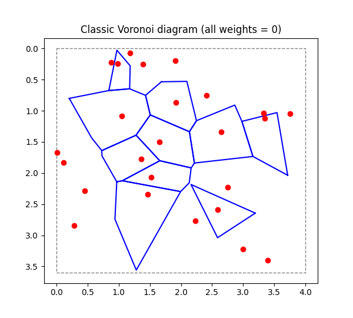
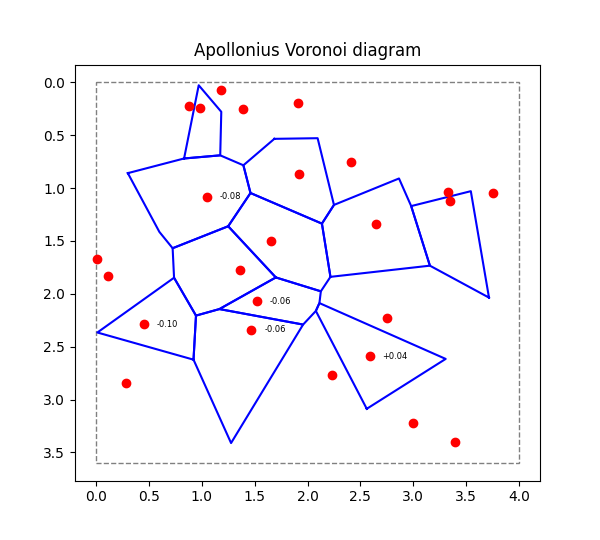

# Apollonius Weighted Voronoi

Additively weighted Voronoi diagram with bounded faces extraction — powered by CGAL and pybind11, wrapped for Python.


## Requirements

- CMake 3.16+
- Python 3.8+
- MinGW-w64 (or MSVC)
- [vcpkg](https://github.com/microsoft/vcpkg) with:
  - `cgal`
  - `boost-algorithm`
  - `boost-system`
- [pybind11](https://github.com/pybind/pybind11) cloned locally


## How to Use

**Import the module:**
```python
from voronoi import weighted_voronoi as wv
```

**Build the weighted Voronoi (Apollonius) diagram:**
```python
cells = wv.build_apollonius_polygons(points, radii)
```

**Arguments:**

- `points`: list of 2D coordinates, e.g. `[(x1, y1), (x2, y2), ...]`
- `weights`: list of weights (same length as `points`), e.g. `[w1, w2, ...]`

**Returns:**

A list of `VoronoiCell` objects with:
- `.index`: index of the cell (int)
- `.boundary`: polygon boundary as list of `(x, y)` coordinates (list of tuples)

> If you need to **crop cells to a bounding box**, do it manually (see `example/weighted_diagram_demo.py` for reference).


## Example

Example script: [weighted_diagram_demo.py](example/weighted_diagram_demo.py) (builds and visualizes a diagram)
<p align="center">
  
  
</p>


## Acknowledgements

This project draws initial inspiration from a code fragment discussed on [StackOverflow](https://stackoverflow.com/questions/18274584/cgal-2d-apollonius-diagram-for-weighted-voronoi-how-to-generate-and-get-the-fa). The current implementation was significantly refactored, extended, and wrapped with pybind11 for Python interoperability.
